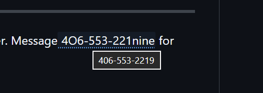

# 📞 Phone Number Decoder

A Microsoft Edge extension that detects and decodes obfuscated phone numbers
on community bulletin boards. People often spell out digits to deter automated
scrapers — this extension shows you the real number on hover.

Put your mouse cursor over an obfuscated phone number and a tooltip will show the decoded version:



## Installation

**WARNING**: only install this if you are confident you know what you're doing

1. Clone or download this repository
2. Open Edge and navigate to `edge://extensions`
3. Enable **Developer mode** (toggle in the bottom-left)
4. Click **Load unpacked** and select this repo's folder
5. Click the reload button on the extension card after editing

## How It Works

The extension scans page content for phone numbers that contain obfuscated
digits — spelled-out number words, phonetic spellings, or lookalike characters.
When it finds one, it adds a dotted underline. **Hover over it** to see the
decoded number in a tooltip.

Plain numeric phone numbers are left untouched.

## Examples

Below are synthetic examples showing the kinds of obfuscation the extension
handles. You can paste these into any page matched by your `manifest.json` to
test the extension.

---

Call or text 425- three six one 8823

> Decoded: **425-361-8823**

---

Please text 360-eight five2-seven190 for details

> Decoded: **360-852-7190**

---

Message 4O6-553-221nine for pictures

> Decoded: **406-553-2219**

---

Text Seven- two- eight-195-Six- 3-3-Six. Or email us.

> Decoded: **728-195-6336**

---

Text. Four one two 685 three seven one nine for info.

> Decoded: **412-685-3719**

---

Call nine oh two-four oh 8-5671

> Decoded: **902-408-5671**

---

## Popup Controls

Click the extension icon in the toolbar to:

- **Toggle** decoding on/off for the current page
- **See stats** — how many numbers were decoded on the page

## Running Tests

```
node test/decoder.test.js
```

The test suite includes corpus tests (various obfuscation styles), contextual
tests (numbers embedded in realistic sentences), and negative tests (prices,
years, addresses, and prose that should not trigger decoding).

## Project Structure

```
phonenumbers/
├── manifest.json        # Extension manifest (Manifest V3)
├── decoder.js           # Core decoding engine
├── content.js           # Content script — scans pages and adds tooltips
├── content.css          # Tooltip styling (dotted underline + highlight)
├── background.js        # Service worker for badge count
├── popup.html/js/css    # Extension popup UI
├── icons/               # Extension icons
└── test/
    ├── decoder.test.js  # Unit tests
    └── corpus.json      # Test corpus of obfuscated patterns
```

## Configuring for Your Site

The extension targets URLs in `manifest.json` → `content_scripts` → `matches`.
It looks for post content in `div.content` elements (standard phpBB layout).
If your forum uses different markup, edit the selector in `content.js`:

```js
const contentDivs = document.querySelectorAll('div.content');
```
